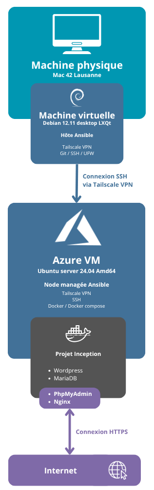

<br>

> En cours de refactorisation complète, au vu d'évaluation début août. J'ai fait le choix d'utiliser des serveurs physiques maisons pour simuler une infra cloud : meilleure sécurisation des données, meilleure compréhension des enjeux de sécurité, et surtout, pas de facturation mensuelle pour l'hébergement.

<br>

## Index

- [Consigne](#consigne)
- [Architecture](#architecture)
  - [VM Ansible Host](#vm-ansible-host)
  - [Raspberry Pi 4](#raspberry-pi-4)
  - [ThinClient](#thinclient)
  - [Cloudflare Tunnel et Cloudflare](#cloudflare-tunnel-et-cloudflare)

<br>

## Consigne

- 42 ne fournit pas les serveurs nécessaires pour exécuter votre application. Tout votre code devra être hébergé sur des serveurs en dehors de l’école, que vous devrez obtenir (et payer) par vous-même.  
- Ce projet nécessite un accès à des ressources cloud. Plusieurs options sont possibles selon vos besoins et les opportunités disponibles.  
- Le déploiement de votre application doit être entièrement automatisé. Il est suggéré d’utiliser Ansible, mais vous êtes libre d’utiliser un autre outil si vous le souhaitez.  
- Il est impératif de fournir un site fonctionnel équivalent à celui obtenu avec Inception, uniquement grâce à votre script.  
- Vous devez installer un site WordPress simple sur une instance.  
- Vous devez vous assurer que :  
  • Votre site peut redémarrer automatiquement si le serveur redémarre.  
  • En cas de redémarrage, toutes les données du site sont conservées (images, comptes utilisateurs, articles, ...).  
  • Il est possible de déployer votre site sur plusieurs serveurs en parallèle.  
  • Le script doit pouvoir fonctionner de manière automatisée, en supposant uniquement que l’instance cible tourne sous Ubuntu 20.04 LTS (ou équivalent), avec un démon SSH actif et Python installé.  
  • Vos applications doivent s’exécuter dans des conteneurs séparés capables de communiquer entre eux (1 processus = 1 conteneur).  
  • L’accès public à votre serveur doit être limité et sécurisé (par exemple, il ne doit pas être possible de se connecter directement à la base de données depuis Internet).  
  • Les services à déployer sont les différents composants d’un WordPress que vous devez installer vous-même (par exemple : PhpMyAdmin, MySQL, ...).  
  • Vous devez avoir un fichier `docker-compose.yml`.  
  • Vous devez vérifier que votre base SQL fonctionne avec WordPress et PhpMyAdmin.  
  • Votre serveur doit pouvoir, si possible, utiliser TLS.  
  • Vous devez vous assurer que, selon l’URL demandée, votre serveur redirige vers le bon site.  

- Le rendu du projet se fait dans votre dépôt Git, comme d’habitude. Seuls les fichiers contenus dans ce dépôt seront évalués lors de la soutenance. Vérifiez bien les noms de vos dossiers et fichiers.  
- Aucun jeu bonus n’est demandé.  
- L’apparence du site ne sera pas jugée en détail : un WordPress de base suffit.  
- Un nom de domaine mémorable n’est pas obligatoire, mais apprécié, surtout s’il permet un accès HTTPS.

<br>

## Architecture

<details>
<summary>Schéma d'architecture (diagram)</summary>

</details>

<details>
<summary>Schéma d'architecture (ascii)</summary>

```
+-----------------------------+
| Machine physique            |
| - Hôte VirtualBox           |
+-----------------------------+
            |
            | VM VirtualBox
            v
+-----------------------------+
| VM Ansible Host             |
| - Debian 12.9 LXQt          |
| - Tailscale                 |
| - Ansible                   |
| - Git / SSH / UFW utils     |
+-----------------------------+
            |
  		    | Tailscale (VPN) 
			| SSH (Authkey only)
		    |
            |________________________________________ [...] Possible autres nodes
            |                                  |
            v                                  v
+------------------------+         +-----------------------+
| Raspberry Pi 4         |         | ThinClient            |
| - Ubuntu Server 22.04  |         | - Ubuntu Server 22.04 |
| - ARM64                |         | - AMD64               |
| - Tailscale            |         | - Tailscale           |
| - UFW, SSH             |         | - UFW, SSH            |
| - Docker               |         | - Docker              |
| - Cloudflared          |         | - Cloudflared         |
| - Projet Inception     |         | - Projet Inception    |
|   - Wordpress          |         |   - Wordpress         |
|   - Nginx              |         |   - Nginx             |
|   - MariaDB            |         |   - MariaDB           |
|   - PhpMyAdmin         |         |   - PhpMyAdmin        |
+------------------------+         +-----------------------+
            ^                                  ^
            |     Cloudflare Tunnel HTTPS      |
            |          vers Nginx:443          |
            v                                  v
+------------------------+         +------------------------+
|  Cloudflare            |         |  Cloudflare            |
|  - Proxy + DNS         |         |  - Proxy + DNS         |
|  - <URL>.com           |         |  - <URL>.com           |
+------------------------+         +------------------------+
           ^                                   ^
           | HTTPS                             | HTTPS
           v                                   v
+-----------------------------------------------------------+
|                         Internet                          |
+-----------------------------------------------------------+
```

</details>

### VM Ansible Host

VM Debian 12.9 avec LXQt, dédiée au déploiement et à l’administration.
- Ansible pour automatiser l’installation et la configuration.
- Git pour la gestion de version.
- UFW pour la sécurité locale.
- Tailscale pour la connexion VPN privée.

<br>

### Raspberry Pi 4

Raspberry Pi 4, sous Ubuntu Server 22.04 en ARM64.
Il sert de nœud applicatif pour héberger les services du projet.
- Tailscale pour rejoindre le réseau privé.
- UFW pour filtrer les connexions.
- Docker pour l’isolation des services.
- Cloudflared pour publier les services via Cloudflare Tunnel.
- Projet Inception (WordPress, Nginx, MariaDB, PhpMyAdmin).

> L'authentification SSH est en Authkey only, pas de mot de passe, pour sécurité renforcée

<br>

### ThinClient

Client léger x86_64 sous Ubuntu Server 22.04.
Il héberge la même stack que le Raspberry Pi pour tester la redondance et la portabilité.
- Tailscale pour le VPN privé.
- UFW pour le filtrage réseau.
- Docker pour l’exécution des conteneurs.
- Cloudflared pour exposer les services.
- Projet Inception (WordPress, Nginx, MariaDB, PhpMyAdmin).

> L'authentification SSH est en Authkey only, pas de mot de passe, pour sécurité renforcée

<br>

### Cloudflare Tunnel et Cloudflare

Chaque serveur a un tunnel sécurisé avec Cloudflared.  
- Les services internes (Nginx sur `localhost:443`) restent inaccessibles depuis Internet.  
- Le trafic est chiffré de bout en bout.  
- Cloudflare sert de proxy inverse et DNS.  
- Chaque tunnel pointe vers un sous-domaine dédié.  
- TLS est géré côté Cloudflare.  
- Possible gestion d'authentification via Cloudflare Access.  
- Les serveurs locaux ne sont jamais exposés directement.

<br>

---

